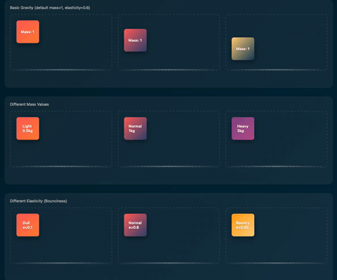
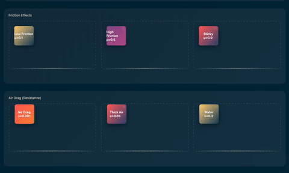
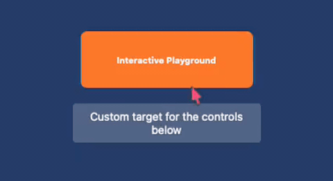
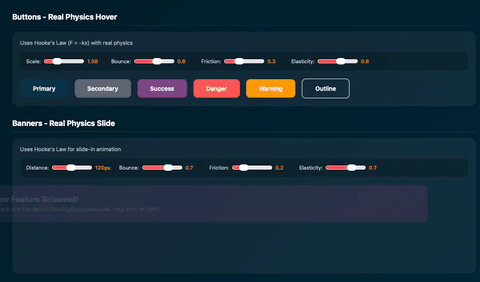
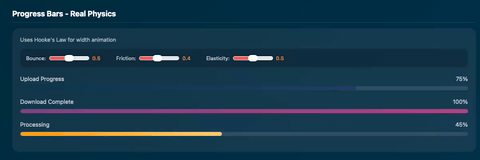
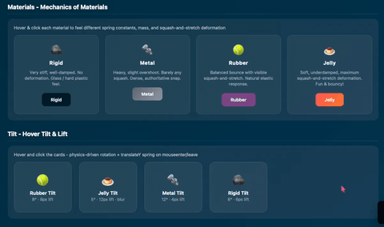
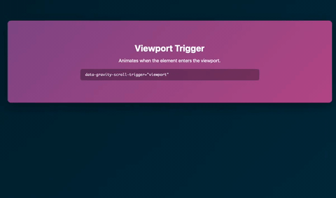

<p align="center">
  
</p>
<h1 align="center">GravityJS Animations</h1>
> Physics-based UI animations powered by Hooke's Law spring simulation and Newtonian gravity.

GravityJS Animations provides two complementary physics systems for the web:

| System | What it does | Entry point |
|---|---|---|
| **UI Components** | Spring-animated buttons, cards, accordions, alerts, and more - steered by `data-gravity-*` attributes | `initComponents()` |
| **Gravity Engine** | Newtonian falling / bouncing DOM elements with configurable mass, elasticity, and friction | `initGravity()` / `GravityEngine` |

No dependencies. Zero configuration required. Works with vanilla HTML and is framework-compatible with React, Vue, and Angular via `data-gravity-*` attributes.



---

## Table of Contents

- [Table of Contents](#table-of-contents)
- [Presentation](#presentation)
- [Installation](#installation)
  - [npm](#npm)
  - [CDN](#cdn)
- [Quick Start](#quick-start)
  - [Vanilla HTML via CDN](#vanilla-html-via-cdn)
  - [Via npm (ESM / TypeScript)](#via-npm-esm--typescript)
  - [Live Demo](#live-demo)
- [UI Components Overview](#ui-components-overview)
- [Gravity Engine](#gravity-engine)
- [Framework Integration](#framework-integration)
- [Physics Tuning](#physics-tuning)
- [Material Hints](#material-hints)
- [Advanced Features](#advanced-features)
- [API Reference](#api-reference)
- [CSS Utilities](#css-utilities)
- [Versioning](#versioning)
- [License](#license)
- [Contact](#contact)

---

## Presentation

Below are additional demo animations showcasing GravityJS Animations in action:













## Installation

### npm

```bash
npm install gravityjs-animations
```

### CDN

```html
<script src="https://unpkg.com/gravityjs-animations@latest/dist/gravityjs.umd.js"></script>
```

When loaded via this UMD bundle, all exports are available on the global `window.GravityJS` object.

From npm, GravityJS Animations exposes a single `'gravityjs-animations'` entrypoint with ESM and CommonJS builds plus bundled TypeScript types; the build is tested to ensure these imports resolve correctly.

---

## Quick Start

### Vanilla HTML via CDN

```html
<!DOCTYPE html>
<html>
<body>

  <!-- Physics spring hover on a button -->
  <button data-gravity-button>Hover me</button>

  <!-- Card that lifts on hover with animated shadow -->
  <div data-gravity-card style="padding:24px;border-radius:12px;background:#fff;">
    <h3>Card Title</h3>
    <p>Hover to lift with a spring.</p>
  </div>

  <!-- Accordion with physics open/close -->
  <div data-gravity-accordion>
    <button>What is GravityJS?</button>
    <div class="accordion-content">
      <div>A physics-based animation library for the web applications. Use it in Angular, Vue, React or vanilla HTML.</div>
    </div>
  </div>

	  <script src="https://unpkg.com/gravityjs-animations@latest/dist/gravityjs.umd.js"></script>
  <script>
    GravityJS.initComponents(); // scan DOM and activate all data-gravity-* elements
  </script>

</body>
</html>
```

### Via npm (ESM / TypeScript)

```ts
import { initComponents } from 'gravityjs-animations';

// Call once after the DOM is ready - returns a teardown function
const teardown = initComponents();

// Clean up all instances and the MutationObserver (e.g. on SPA route change)
// teardown();
```

### Live Demo

You can explore GravityJS Animations in your browser at:

https://gravityjs.andrzejskowron.pl – Gravity Engine and deformation examples, UI components gallery and Scroll-triggered animations


---


## UI Components Overview

See **[UI Components Reference](./README.components.md)** for the full UI Components documentation.

## Gravity Engine

See **[Gravity Engine](./docs/gravity-engine.md)** for detailed usage.

## Framework Integration

See **[Framework Integration](./docs/framework-integration.md)** for React, Vue, and Angular examples.

## Physics Tuning

See **[Physics Tuning](./docs/physics-tuning.md)** for tuning recipes.

## Material Hints

See **[Material Hints](./docs/material-hints.md)** for material presets.

## Advanced Features

See **[Advanced Features](./docs/advanced-features.md)** for motion blur, text animation, scoped init, and more.

## API Reference

See **[API Reference](./docs/api-reference.md)** for function and type details.

## CSS Utilities

See **[CSS Utilities](./docs/css-utilities.md)** for stylesheet usage.

## Versioning

GravityJS Animations follows [Semantic Versioning](https://semver.org/). The **1.x** line indicates that the public `gravityjs-animations` package
and CDN bundle APIs are considered stable: new features and bug fixes in 1.x will not intentionally break the behaviours
documented in this README. Breaking changes will be released under a new major version (2.0.0, 3.0.0, ...).

## License

MIT © 2026 Andrzej Skowron and GravityJS Animations Contributors
(See LICENSE for attribution requirement details.)

## Contact
Andrzej Skowron - <kontakt@andrzejskowron.pl>